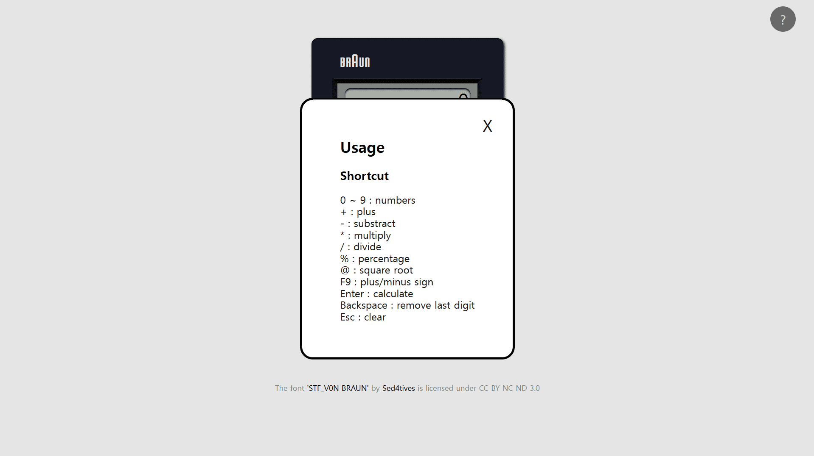

# Braun Calculator

Braun Calculator 프로젝트는 제가 좋아하는 브라운 사의 계산기를 웹으로 옮겨본 프로젝트입니다.

배포 주소는 https://qpsqps123.github.io/braun-calculator/ 입니다.

## 사용 방법

계산기는 마우스 또는 키보드를 사용하여 조작할 수 있습니다.

키보드 단축키는 도움말을 통해 확인할 수 있습니다.

## 주요 기능

### 연산

#### 사칙

#### 제곱근

#### 퍼센트

#### 부호 변환

#### 초기화

#### 마지막 입력 값 삭제

키보드 Backspace 키로 사용 가능하며, 마우스 사용은 지원하지 않습니다.

#### 연속

### 오류 처리

#### 분모가 0인 나누기

#### 음수 제곱근

### 계산 가능 범위

계산 가능 범위는 다음과 같습니다.

- -1.7e308 < 값 < 1.7e308
- 0 < 값 < 2.23e-308
- -2.23e-308 < 값 < 0

### 계산 안정성과 디스플레이 표시 형식

다음과 같이 계산 값의 안정성을 보장합니다.

- 일반 표기법은 유효숫자 16번째에서 반올림.
- 지수 표기법은 가수부 소수점 아래 15자릿수에서 반올림.

계산 값은 계산기 디스플레이에 다음과 같이 표시됩니다.

- 일반 표기법은 유효숫자 10번째까지 표시.
- 지수 표기법은 가수부 소수점 아래 4번째 자릿수까지 표시.

## 기술 스택

